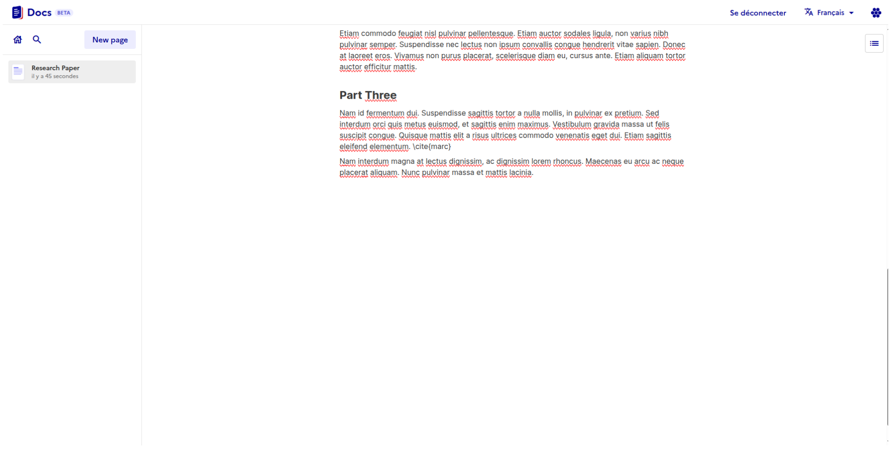
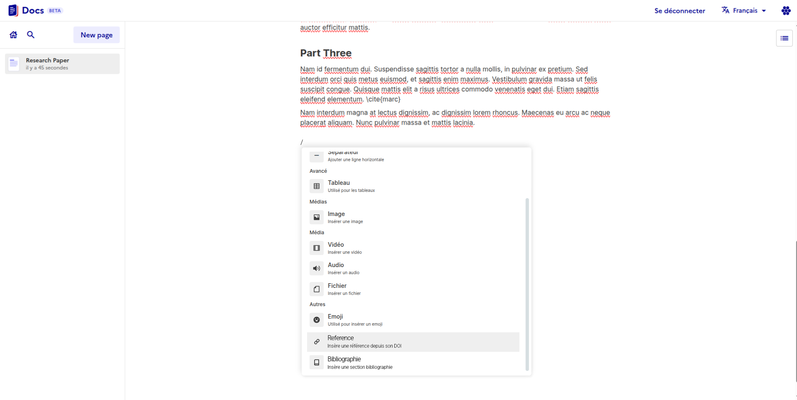
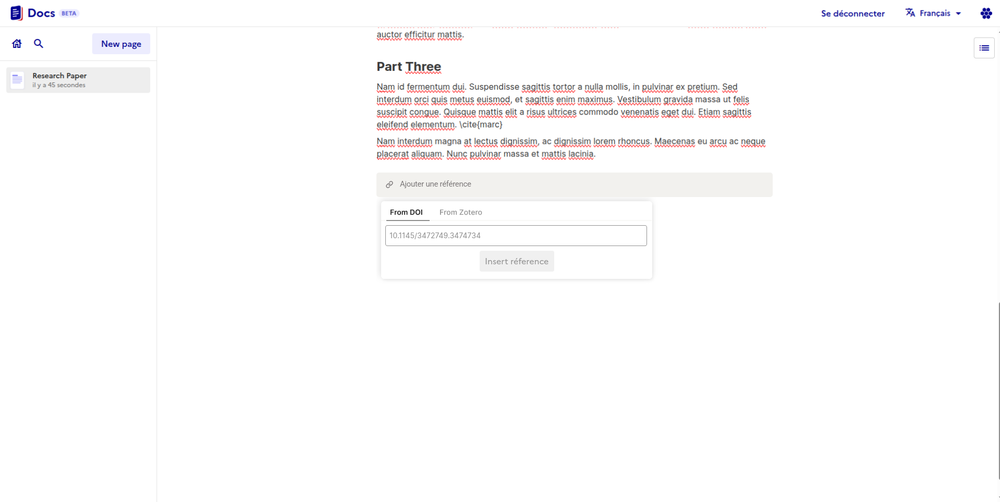
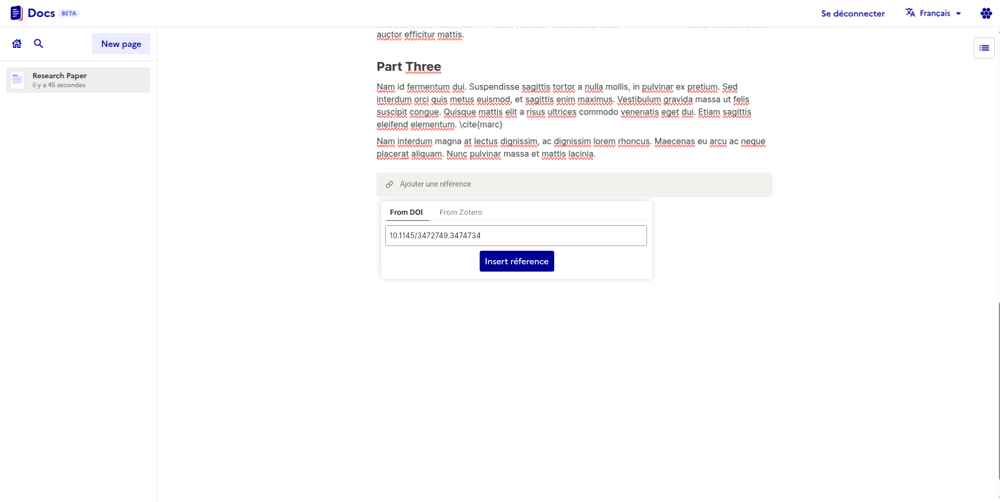
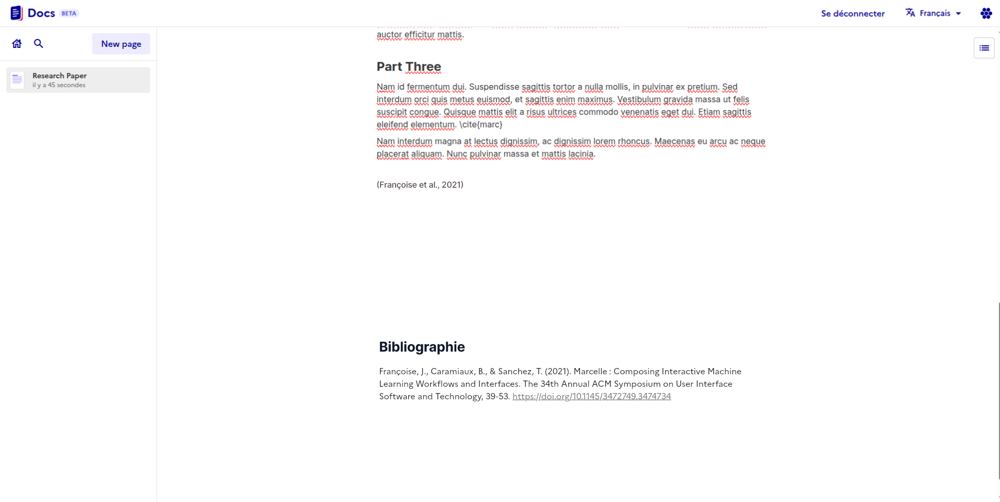
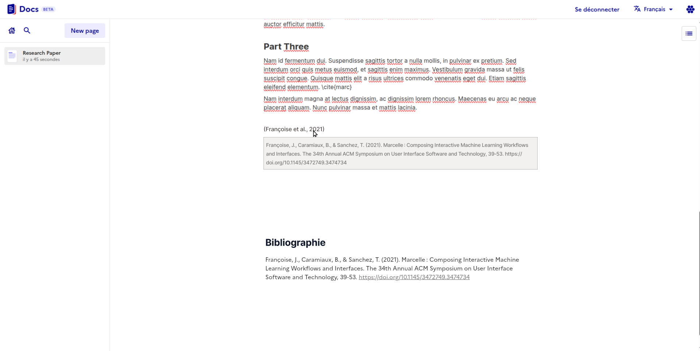
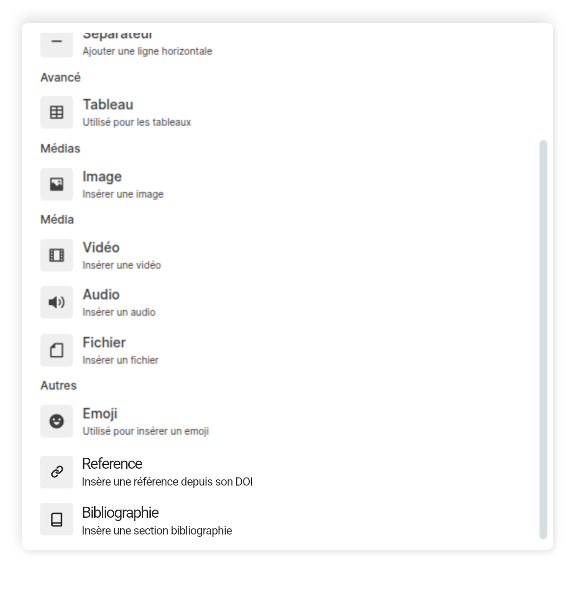
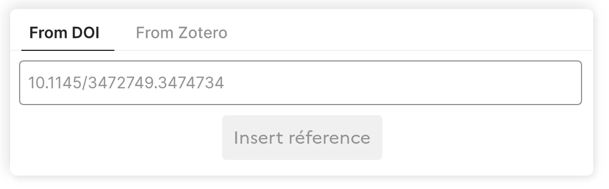

# 🏆 Final Submission for Bib4win

## Project

Docs Bibliography.

## Project Description

A bibliography generation and a citation tool to Docs using a custom block
and custom inline content.

## Contributors

- [@jmaupetit](https://github.com/jmaupetit)
- [@wilbrdt](https://github.com/wilbrdt)
- [@mathilde-lannes](https://github.com/mathilde-lannes)
- [@flipvh](https://github.com/flipvh)
- [@matthewlipski](https://github.com/matthewlipski)

Special thanks to Maeva that joined us on the second day!

- [@Maeva-Calmettes](https://github.com/Maeva-Calmettes)

## Code base

Source code of the project can be found in this Docs' fork:

https://github.com/jmaupetit/docs/tree/add-bibliography

A pull-request will be submitted to the official repository when it's ready.

As most changes live in the BlockNote's repository, one should also check this
pull request:

https://github.com/TypeCellOS/BlockNote/pull/1732/

## Deliverables

### Slidedeck 

### Workflow

### Components

## Key Achievements

Docs now integrates two new `/` slash commands:

- `/reference` (aliased to `/cite`) to integrate a citation in the text flow
  using a [DOI](https://fr.wikipedia.org/wiki/Digital_Object_Identifier). Once
  the DOI has been submitted, all reference metadata will be automatically
  fetched to fill the document's bibliography.
- `/bibliography` block that displays active citations in the core text (in
  their order of apparition).

## Challenges Overcome

Governmental organization have many researchers. However, these important
end-users can't use La Suite Docs if there isn't any support for bibliography
functionality. And if they don't use it, there is also less spillover effect
for students to start using it.

We need to get the researcher/professor/instructor/students to use Docs.

## Impact

There are around 500k **public sector researchers** working and **5m students**
in just France and Germany. With an estimated 10% using
[Zotero](https://www.zotero.org), there is a direct target audience of roughly
550k users.

In general, this bibliography plugin (with the Zotero connect feature) can be
more user-friendly for the public sector compared to for example Google Docs
(integration breaks at each new Google Docs release). Moreover this
Bibliography plugin allows more organizations to step out from proprietary
non-sovereign solutions.

## Next Steps

- Convince La Suite Docs to support Docs templates and a plugin/extension
  system. Because organizations are likely to want to control if and how to
  enable a Bibliograpy tool.
- This contribution will be distributed as standalone package on top of the
  official BlockNote distribution.
- The Zotero integration should be part of this package.
- Bibliography items should be editable in bibtex format.
- Integrate [HAL](https://hal.science) / [ORCID](https://orcid.org) services to
  ease researcher's publication fetching.
