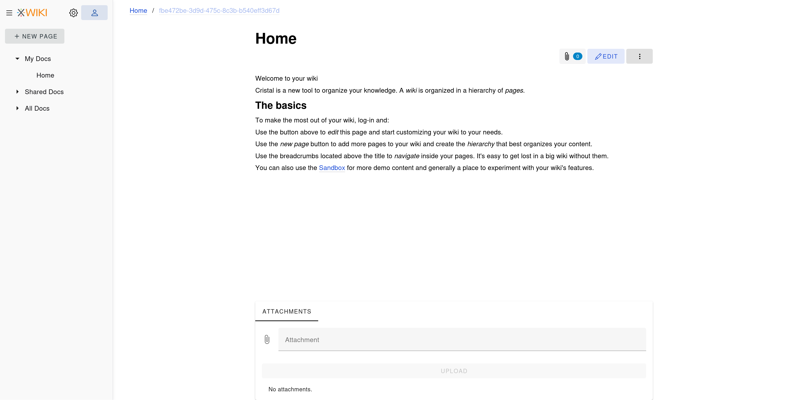
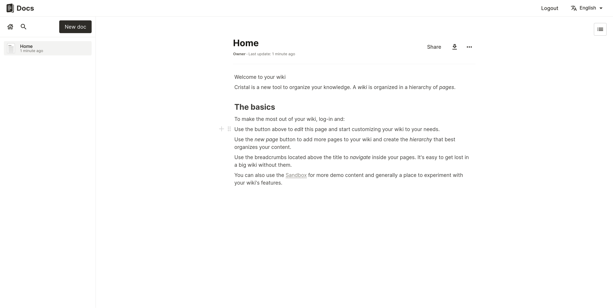

# 🏆 Final Submission for XWiki/Cristal

## Project

Cristal/Docs: an integration of Docs with Cristal, our customizable and modular wiki front-end.

## Project Description

We are adding Docs as a storage backend for Cristal. 
Meaning that Docs is usable from Cristal's UI.
<!--This means one will be able to create and manage pages (documents) inside Cristal, without ever using Docs' UI. Only a Docs server is required. -->

## Contributors
[@manuelleduc](https://github.com/manuelleduc), [@ldubost](https://github.com/ldubost), [@ClementEXWiki](https://github.com/ClementEXWiki)

## Code base

https://github.com/xwiki-contrib/cristal/tree/hackdays-2025

## Deliverables 

In Cristal

In Docs

## Key Achievements

* Integration with Docs authentication (oidc)
* Listing Docs documents
* Rendering Docs documents
* Editing documents
* Listing attachments
* Uploading new attachments
* Listing and rendering previous versions of documents

## Challenges Overcome

* Parsing and serializing content from Docs's storage

## Impact

* One more backend for Cristal
* Access to Docs from an alternative UI while being able to collaborate with users of Docs native UI
  * Ready for nested folders
  * Ability to change theme in a modular way

## Next Steps

* Deleting assets
* Comparing between versions
* (Server-side) Garbage-collecting oprhan assets (assets removed from a document)
* Links and attachments suggestion in the editor