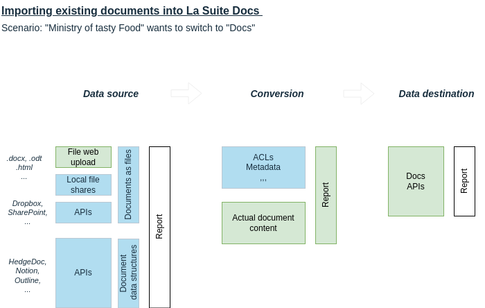

# 🏆 Final Submission for Doc Spec

## Project: Importing Existing documents into La Suite Docs

**What if we can import existing documents, such as Microsoft Word (`.docx`), OpenDocument (`.odt`) and PDF into La Suite Docs?**

### Goal

Build a proof-of-concept for importing `.docx` files into La Suite Docs, enabling users to migrate existing Microsoft Word documents into the new collaborative editor.

## 📄 Project Description

- Implement a working import pipeline from `.docx` to La Suite Docs.
- Provide insight into the challenges of migrating legacy documents.
- Offer a foundation for broader document format support in the future.

## 👥 Contributors

- 🇳🇱 [@ericwout-overheid](https://github.com/ericwout-overheid) (Eric)
- 🇩🇪 [@hhappel](https://github.com/hhappel) (Hans-Jörg)
- 🇷🇴 [@mountainborn](https://github.com/mountainborn) (Silviu)
- 🇳🇱 [@StephanMeijer](https://github.com/StephanMeijer) (Stephan Meijer)

## 🧠 Codebase

- Conversion backend (API): https://github.com/docspec-hackathon/import-api
- Docs integration (UI): https://github.com/docspec-hackathon/docs

This project is based on [NLdoc (GitLab)](https://gitlab.com/logius/nldoc). More information can be found on [nldoc.nl](https://nldoc.nl/).

## 📦 Deliverables 

### 🎬 Screencast

**High quality video below GIF**

[See/download the source document.](assets/docspec-demo.docx)

The video demonstrates several user interaction flows for uploading and importing files.

The first is the drag-and-drop flow, where users can drag files from their device into a designated drop zone on the interface (the "documents" area). This initiates the upload and import process automatically.

The second flow involves using a dedicated upload dialog or modal. In this scenario, users trigger the upload by clicking the dropdown and a button, which opens a file dialog. They can either select files manually or drag them into the dialog, offering flexibility in how files are chosen.

The third flow covers multi-file uploads. Here, users can upload multiple files at once, either via the dialog or drag-and-drop. This flow demonstrates the system’s ability to handle batch processing and concurrent uploads.

Finally, the video includes the error handling flow, showcasing how the system responds when something goes wrong.

[See/download video.](assets/demo2.mp4)

[Alternative way of playing can be found here: https://vimeo.com/1090109520](https://vimeo.com/1090109520)

ℹ️ **In the future, using NLdoc technologies, this system of importing and conversion can also be used for PDF and OpenDocument (`.odt`). The NLdoc platform makes it scalable by using queueing, Server Sent Events and deploying via Kubernetes.**

### Processes

This section outlines the key workflows and drafts developed to support document migration into La Suite Docs.

#### 🗺️ Migration process overview

A high-level visual diagram showing the full migration pipeline from `.docx` to La Suite Docs. Components already implemented are highlighted in green:

For a detailed breakdown of each step and design decision, see the dedicated [README](https://github.com/docspec-hackathon/documentation/blob/main/README.md).

#### 📄 Document conversion reporting format (DRCF)
Draft is available as [document-conversion-reporting-format.md](https://github.com/docspec-hackathon/documentation/blob/main/document-conversion-reporting-format.md)

## ✅ Key Achievements
- Converting ".docx" files (including paragraphs, text and styling, headings, tables, bullet lists, ordered lists, and images) into the La Suite Docs (BlockNote) format.
- Added import button and drag-and-drop functionality to Docs UI
- Creating a draft for generated human-readable reports for conversion issues (not implemented in proof-of-concept).
- Defined and documented a clear migration path to La Suite Docs.

## ⚔️ Challenges Overcome
(What was difficult? What did you solve?)

- Coordinating and aligning a 9-person team in a short time frame
- Narrowing down ambitious ideas into a focused MVP (kill off your darlings)
- Reverse-engineering parts of the `.docx` format and BlockNote spec
- Identifying and reporting bugs in BlockNote - subsequently patched upstream.
- Working under bandwidth constraints and working around that.

## 🌍 Impact

This project benefits:

- **End-users** of La Suite Docs with pre-existing and/or legacy `.docx` files.
- **IT decision-makers** assessing migration feasibility.
- **Developers** working on importers for other formats or systems.
- **The BlockNote ecosystem,** via community-reported improvements.

## 🔮 Next Steps

If further developed, we envision:

- Adding support for more `.docx` features (e.g., links, quotes, code blocks)
- Supporting OpenDocument (`.odt`) format
- Integrating "Convert to Docs" directly into La Suite Drive
- Improving the Document Conversion Report Format (DCRF) into a structured standard (e.g., JSON + UI mapping).
- Displaying conversion warnings and errors inline in the Docs UI.

ℹ️ **In the future, using NLdoc technologies, this system of importing and conversion can also be used for PDF and OpenDocument (`.odt`). The NLdoc platform makes it scalable by using queueing, Server Sent Events and deploying via Kubernetes.**