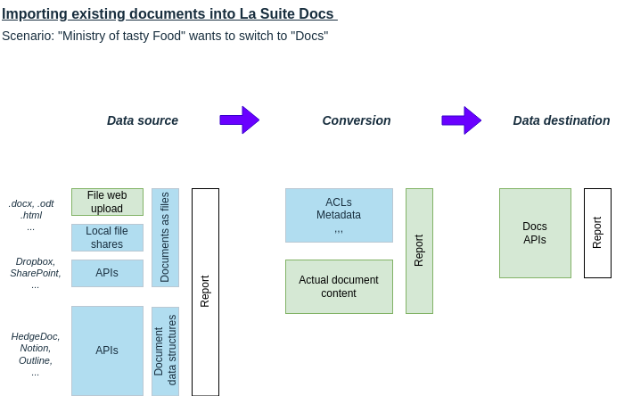

# 🏆 Final Submission for Doc Spec

## Project
Import existing documents into Docs

## Project Description
- Line out the overall process and challenges of successfully moving existing documents to Docs
- Implement a PoC for importing ".docx" files into Docs

## Contributors
<a href="https://github.com/ericwout-overheid">@ericwout-overheid</a>, <a href="https://github.com/hhappel">@hhappel</a>, <a href="https://github.com/mountainborn">@mountainborn</a>, <a href="https://github.com/StephanMeijer">@StephanMeijer</a>

## Code base
- Document conversion: https://github.com/docspec-hackathon/import-api
- Docs UI integration: https://github.com/docspec-hackathon/docs

## Deliverables 
(Provide a link to a live demo, if you have one)
(Add screenshots (image, gif or video) and presentation deck to `/assets`)

### Screencast
TBD

### Migration process overview
An overview describing aspects in the migration of documents to Docs (highlighting implemented aspects in green):

The diagram is further explained in another [README.md](https://github.com/docspec-hackathon/documentation/blob/main/README.md)

### Document conversion reporting format (DRCF)
Draft available as [document-conversion-reporting-format.md](https://github.com/docspec-hackathon/documentation/blob/main/document-conversion-reporting-format.md)

## Key Achievements
- Converting ".docx" files (including headings, tables, bullet lists, and images) into the Docs (BlockNote) format
- Adding am import button and drop-zone into the Docs UI
- Providing a report about conversion issues to the user
- Mapping out the overall process of switching a document base to Docs

## Challenges Overcome
(What was difficult? What did you solve?)

- Working out a plan for 9 interested people
- Creating a focused plan from excellent broad ideas (kill off your darlings)
- Grind down the ".docx" specification
- Getting used to limited network bandwidth and working around that

## Impact
(Who will benefit from your project?)

- All users of Docs which have pre-existing ".docx" documents (may be applicable to Drive users as well)
- IT deciders which want to understand the full process of moving to Docs
- Developers writing imports for other document types or sources

## Next Steps
(If you were to continue, what next steps or developments would you envision?)

- Converting additional aspects of ".docx" to Docs (e.g., ordered lists, quotations, code block)
- Adding support for OpenDocument ".odt" to Docs conversion
- Adding some "convert to Docs" option to La Suite Drive
- Further refining the document conversion reporting format
- Allow to show document conversion issues inline in Docs
