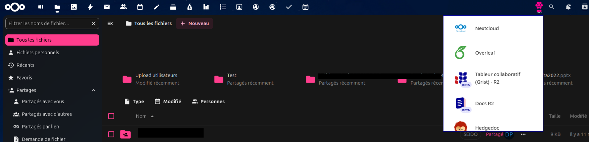
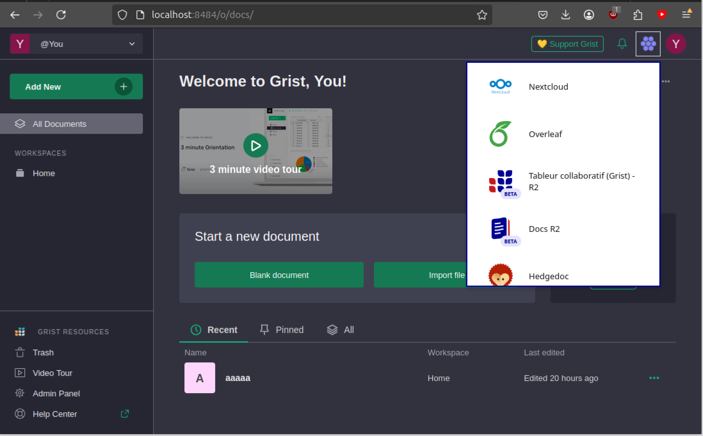

# 🏆 Final Submission for ErgonoGrist

## Project

Improve the UX of Grist features

## Project Description

1. 🗺️ Enable Markdown for [document tours](https://support.getgrist.com/document-tours/)
2. 🧇 Improve documentation and reusability of the ["Gaufre"](https://integration.lasuite.numerique.gouv.fr/guides/gaufre/) in grist, docs, and drive
3. 📤 Enable sending attachments through [Grist forms](https://www.getgrist.com/forms/)

## Contributors

<a href="https://github.com/tayflo">@tayflo</a>, <a href="https://github.com/mrdev023">@mrdev023</a>, <a href="https://github.com/ogui11aume">@ogui11aume</a>, <a href="https://github.com/mclegrand">@mclegrand</a>

## Code base

1. 🗺️ Markdown for GristDocTour 
   1. [grist-core#1653](https://github.com/gristlabs/grist-core/pull/1653) - Allow Markdown in GristDocTour
2. 🧇 Gaufre
   1. [integration#26](https://github.com/suitenumerique/integration/pull/26) - Allow Gaufre customization, fix relative URL for static html, Github action to build and host it on github pages, and provide full documentation on how to use it
   2. [ui-kit#81](https://github.com/suitenumerique/ui-kit/pull/81) - Allow to pass a custom gaufre.js URL through ui-kit uses of Gaufre in `<LaGaufre>`
   3. [drive#205](https://github.com/suitenumerique/drive/pull/205) - Pass an env variable to Drive to use a custom gaufre.js - depends on 2
   4. [docs#1038](https://github.com/suitenumerique/docs/pull/1038) - Pass an env variable to Docs to use a custom gaufre.js
   5. [Tests](https://github.com/suitenumerique/integration/commit/266a7af9c7fcd1e3bce85ca09a4dfa8c556965a3) - Modification of Gaufre contents to point to personal hosted services
3. 📤 Add Form attachment
   1. 📁 [grist-core#1655](https://github.com/gristlabs/grist-core/pull/1655) - Add support for attachments in forms
   2. 🦠 [grist-core#1654](https://github.com/gristlabs/grist-core/pull/1654) - Add Virus scan provider

## Deliverables

### 🗺️ Markdown for GristDocTour

[Documentation and presentation](assets/markdown-for-gristdoctour/deliverable1.md)

### 🧇 Custom Gaufre

These screenshots show a personal Nextcloud instance with the custom Gaufre (from point 5) and an addition of the Gaufre to a local instance of Grist.

### 📤 Grist attachment upload through forms

Allow submit attachment in Form view.

[More informations](./assets/add-attachments-form/README.md)

Future good changes:
 - Improve current file input style because the icon is very small. It can be more ergonomic if the icon is more bigger.

### Add Virus scan provider

Currently, Grist not support Virus checking during attachment upload.
Add a provider abstraction to scan uploaded attachment with provider and delete it if a virus is detected.
With Form attachment feature, it's important to scan new file to avoid malicious files to uploaded in public form.

Future good changes:
 - Add a "state" for all files uploaded. "pending", "validated", "malicious", ... and UI to show this state to the user in Grid View.
 - Autocleanup all references of a deleted file in all documents to avoid broke UI.

## Key Achievements

* 🏆 Succeeded in fixing 3 Grist issues identified by the team 
* 🏆 Submitted 8 pull requests to official repositories

## Challenges Overcome

* Enabling attachments in form in a way that respect Grist principles
* Putting together all the knowledge necessary to configure the Gaufre (some assets are on private repository in the deployment phase)

## Impact

* 🎯 Contribute to grist-core by adding the feature sending attachments through Grist forms (pull-request), a feature regulargy asked for by users (see [grist-core issue #886](https://github.com/gristlabs/grist-core/issues/886))
  * Benefits the whole Grist community
  * Better UX for file submission
* 🎯 Contribute to grist-core by adding the feature Markdown in GristDocTour, a very 💗 Grist functionality to introduce documents
  * Benefits the whole Grist community
  * Better UX for documenting the presentation of Grist documents
* 🎯 Make the Gaufre a reusable easily-added integration UI component for locally hosted set of services

## Next Steps

* Follow-up on pull requests to [gristlabs/grist-core](https://github.com/gristlabs/grist-core)
* Improve attachments sending button design, in order to fit Grist design system (see [design proposal](./assets/grist_form-send-attachment_no-file-selected.png))

### Other identified issues 

* [Grist] Loading spinner when rendering widgets to avoid "white screen" effect which is not a desirable UX
* [Grist] Fix search within forms
* [Grist] Fix Drop-down only loads 30 options (checkboxes)
* [Grist] Fix Dropdown from lists only loads 1000 entries 
* [Grist] Copy a widget from one page to another
* [Grist] Anchors to navigate in history (actual behavior is anchor appears briefly and disappears)
* [Grist] Expose user object in forms
* [Grist] Settings for webhooks to filter payload being sent and choose expected HTTP return codes that are handled
