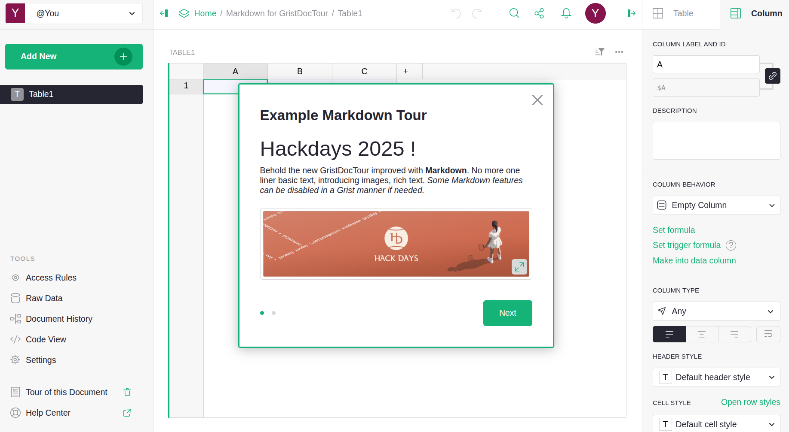

# 🏆 Final Submission for ErgonoGrist

## Project

Improve the UX of Grist features

## Project Description

1. Enable Markdown for [document tours](https://support.getgrist.com/document-tours/)
2. Documentation of the ["Gaufre"](https://integration.lasuite.numerique.gouv.fr/guides/gaufre/) for Grist
3. Enable sending attachments through [Grist forms](https://www.getgrist.com/forms/)

## Contributors

<a href="https://github.com/tayflo">@tayflo</a>, <a href="https://github.com/mrdev023">@mrdev023</a>, <a href="https://github.com/ogui11aume">@ogui11aume</a>, <a href="https://github.com/mclegrand">@mclegrand</a>

## Code base

1. Markdown for GristDocTour 
   1. [grist-core#1653](https://github.com/gristlabs/grist-core/pull/1653) - Allow Markdown in GristDocTour
2. Gaufre
   1. [integration#26](https://github.com/suitenumerique/integration/pull/26) - Allow Gaufre customization, fix relative URL for static html, Github action to build and host it on github pages, and provide full documentation on how to use it
   2. [ui-kit#81](https://github.com/suitenumerique/ui-kit/pull/81) - Allow to pass a custom gaufre.js URL through ui-kit uses of Gaufre in `<LaGaufre>`
   3. [drive#205](https://github.com/suitenumerique/drive/pull/205) - Pass an env variable to Drive to use a custom gaufre.js - depends on 2
   4. [docs#1038](https://github.com/suitenumerique/docs/pull/1038) - Pass an env variable to Docs to use a custom gaufre.js
   5. [Tests](https://github.com/suitenumerique/integration/commit/266a7af9c7fcd1e3bce85ca09a4dfa8c556965a3) - Modification of Gaufre contents to point to personal hosted services
3. Form attachments
   1. *To be documented*

## Deliverables

### Markdown for GristDocTour

[Documentation and presentation](assets/markdown-for-gristdoctour/deliverable1.md)

### Custom Gaufre

These screenshots show a personal Nextcloud instance with the custom Gaufre (from point 5) and an addition of the Gaufre to a local instance of Grist.

### Grist attachment upload through forms

*To be documented*

## Key Achievements

(Highlight the main features or breakthroughs)

## Challenges Overcome

* Enabling attachments in form in a way that respect Grist principles
* Putting together all the knowledge necessary to configure the Gaufre (some assets are on private repository in the deployment phase)

## Impact

* Contribute to grist-core by adding the feature sending attachments through Grist forms (pull-request), a feature regulargy asked for by users (see [grist-core issue #886](https://github.com/gristlabs/grist-core/issues/886))
  * Benefits the whole Grist community
  * Better UX for file submission
* Contribute to grist-core by adding the feature Markdown in GristDocTour, a very 💗 Grist functionality to introduce documents
  * Benefits the whole Grist community
  * Better UX for documenting the presentation of Grist documents
* Make the Gaufre a reusable easily-added integration UI component for locally hosted set of services

## Next Steps

* Follow-up on pull requests to [gristlabs/grist-core](https://github.com/gristlabs/grist-core)
* Improve attachments sending button design, in order to fit Grist design system (see [design proposal](./assets/grist_form-send-attachment_no-file-selected.png))
