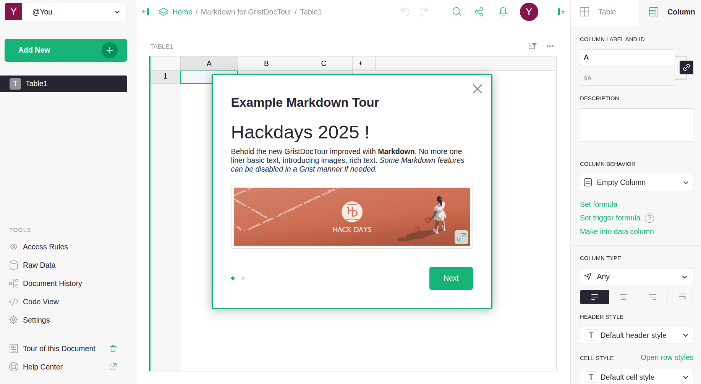
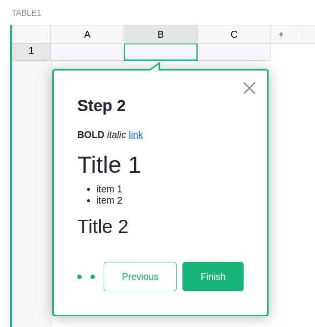
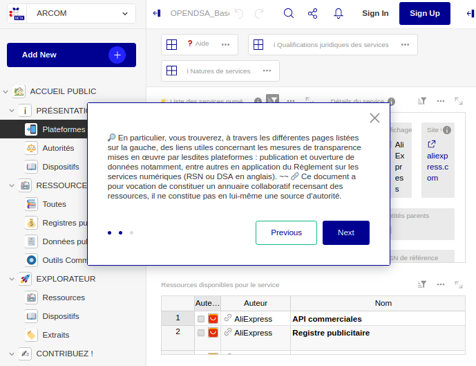
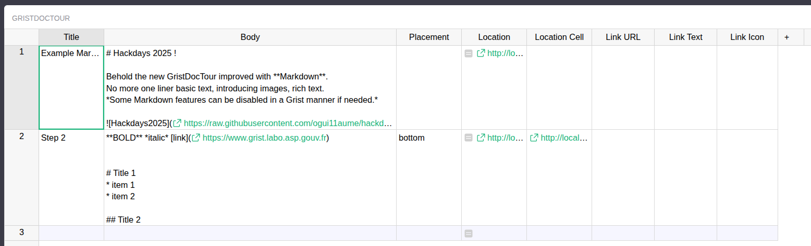
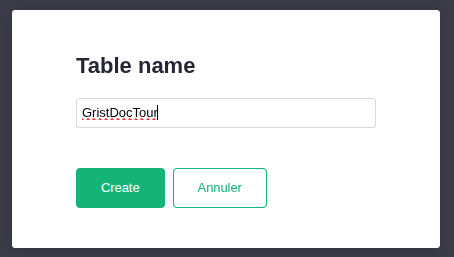
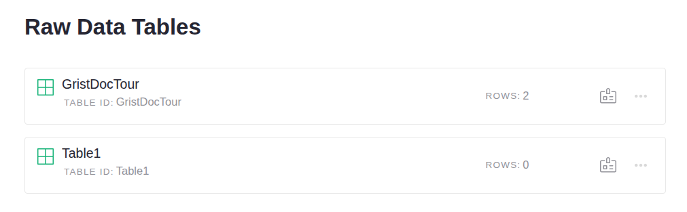
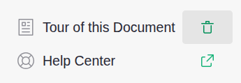

# GristDocTour example





## Why Markdown in document tours ?

So far Grist only permits raw text that appears as a one-liner : not a very nice user experience for somebody to get a first impression of your super Grist document. 🙁

Here what it looked like before (real world example): 



With Markdown, the document tours are much better: 
* possibility to add clickable links (multiple) to external resources
* possibility to add images
* links are directly within the text, not handled as a separate data

The example demo below showcases all the possibilities.

## How to import the example MarkDown tour

You may get the Grist document here that already has the GristDocTour table filled in with sample markdown: 

[Get the example Grist document here](Markdown-for-GristDocTour.grist)

Here is the content of the table for the demo GristDocTour.
This shows the Markdown being used and the usage (and non usage) of certain columns.


## How to create a MarkDown Tour from scratch

Here is the step-by-step guide to create a generic tour for a default basic document with Table1:
https://support.getgrist.com/document-tours/ 

Below a few screenshots of the main steps : 





## Demo

The demo starts automatically the first time the document is accessed.
It is then possible to launch the tour manual using the **Tour this document** button on the bottom left.



# Changes to Grist-core codebase 

app/client/ui/DocTour.ts:
```TypeScript 
import {marked} from "marked";
import {renderer} from 'app/client/ui/DocTutorialRenderer';
import {sanitizeTutorialHTML} from "./sanitizeHTML";
...
const bodyHtmlContent = sanitizeTutorialHTML(marked.parse(getValue("Body"), {
      async: false, renderer
    }));
    const element = document.createElement('div');
    element.innerHTML = bodyHtmlContent;
```

New renderer file 
app/client/ui/DocTourRenderer.ts:
```TypeScript 
import {marked} from 'marked';

export const renderer = new marked.Renderer();

renderer.link = ({href, text}) => {
  return `<a href="${href}" target="_blank">${text}</a>`;
};

```
This specific renderer is implement in a Grist manner to make sure external links are opened in a new windows.
