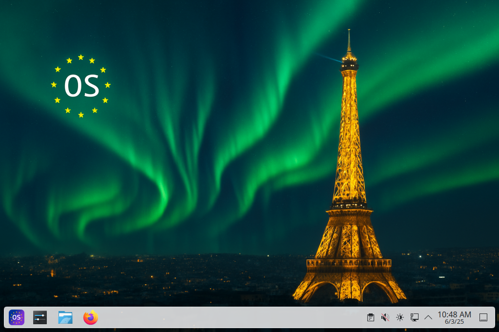
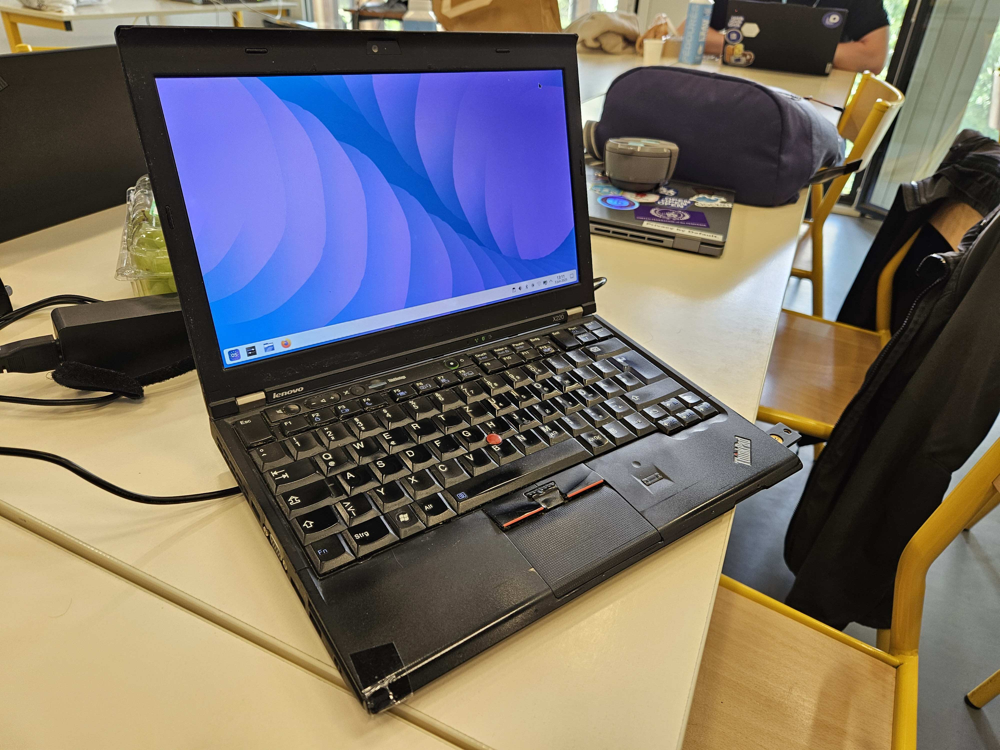

# 🏆 Final Submission for EU-OS

## Project
Create a soverign operating system for the public sector. 

## Project Description
In 2025, new technologies make it possible to finally have a reliable linux desktop. Chip manufacturers are investing more in drivers, desktop environments are getting less buggy and more like Windows, and new container technologies make deploying a linux desktop solution an ease.

In this project, we attempt to apply these improvements to an OS meant for the public sector. We use [bootc](https://github.com/bootc-dev/bootc/), a project that allows deploying containers as an operating system. We combine that with KDE, a desktop environment that mirrors Windows. Then finally, we use [Foreman](https://theforeman.org), an enterprise tool for managing servers, to perform fleet management. The end result is a reliable OS for day to day use, that allows IT administrators to easily manage their fellow public sector employees' computers.

## Contributors
* Team Lead: Robert @rriemann
* Members
    * Antheas Kapenekakis @antheas
    * Sven Neuhaus @neuhaus
    * Rene Fischer @securitykernel
    * Timothee Ravier @travier
    * Sebastian Luebke
    * Andreas Gall
    * Bulcsu Cseke

## Code base
https://gitlab.com/eu-os/eu-os (We need on-prem so github is not an option; actions need to run on gitlab-ci)

## Deliverables 
We deployed the final project on a laptop and installed foreman on a web server that can be used to manage it.

## Key Achievements
* Create a bootc image that can be deployed to computers locally or through a container image store
* Create an unattended ISO that can be used to install the OS to computers
* Install Foreman on a server and configure it to manage the deployed instances

## Impact
* Access to this OS **cannot be revoked** by third party companies/governments. It would be completely under the control of EU.
* Such a project would allow **salvaging** computers that **cannot run Windows 11**
* It can be deployed on cheap devices, with a **minimal service agreement** cost, to provide widespread access to computing
* For basic usecases, e.g., data entry for citizen information, it can replace existing Windows workstations and provide a more reliable longterm solution than relying on Windows

## Next Steps
Slowly start creating workflows for moving infrastructure on-prem, and on how to deploy different application stacks depending on the OS usecase.
