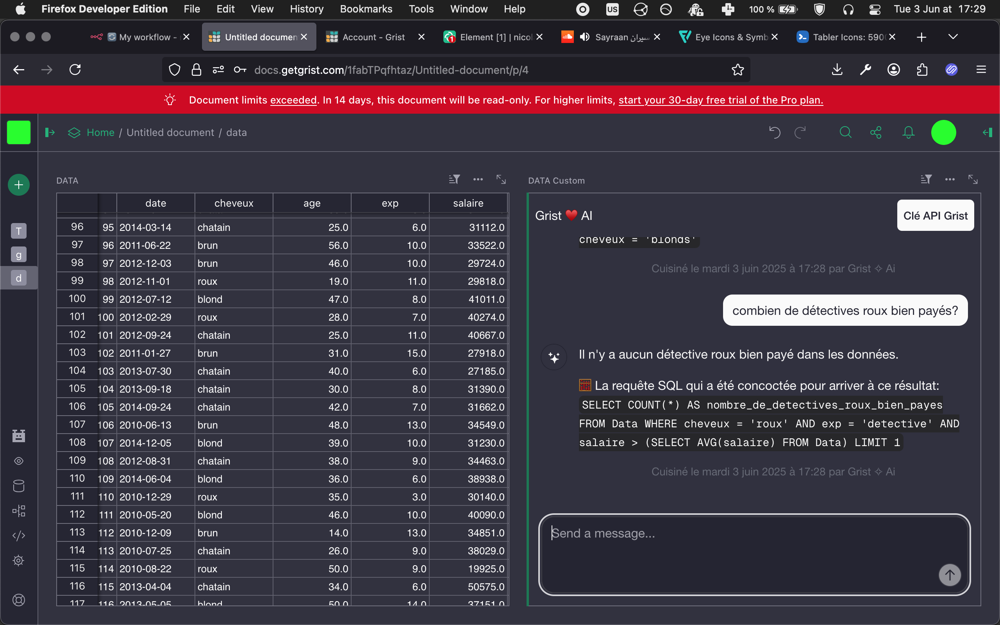

# 🏆 Final Submission for Grist <3 AI

## Project

An Albert AI Chatbot implementation in Grist

## Project Description

**Seamlessly Interact with Your Data Using the Albert API**

While Grist Labs provides a built-in AI agent, it comes with several limitations—such as the inability to integrate custom agents, and limited assurances around data privacy and digital sovereignty with its use of a commercial AI model (ChatGPT).

To address these issues, we developed a custom AI chatbot powered by Albert, fully integrated into Grist via a custom widget. Our solution prioritizes flexibility, user control, and data confidentiality.

## Contributors

<a href="https://github.com/nic01asfr">@nic01asfr</a>, <a href="https://github.com/Taha-130">@Taha-130</a>, <a href="https://github.com/nicolassaint">@nicolassaint</a>, <a href="https://github.com/SamuelRiversMoore">@SamuelRiversMoore</a>, <a href="https://github.com/tasinttttttt">@tasinttttttt</a>

## Code base

Frontend : https://github.com/tasinttttttt/grist---ai

Backend API : https://github.com/Nicolassaint/api-grist-ai-hackdays

## Deliverables

## Key Achievements

We managed to structure our solution around the following workflow:

1. A chat interface is implemented using the Grist widget API.
2. User inputs are sent to a backend endpoint.
3. The backend analyzes each message to determine whether it's a general question or a data analysis request.
4. For data-related queries, a custom prompt is generated and passed to Albert, along with the relevant Grist table schema.
5. Albert generates an appropriate SQL query.
6. The SQL query is executed from the backend through the Grist API.
7. The result is interpreted by Albert and transformed into a human-readable response.
8. This response is then displayed back in the chat interface.

## Challenges Overcome

Our team is made of diverse technical backgrounds and perspectives, united by a shared interest in exploring AI integration within Grist.

Initially, we faced challenges in defining the project scope and understanding the limits and capabilities of the available APIs and tools. After extensive experimentation, we finally found out an effective approach: instead of having Albert interact with API methods directly, we had it generate SQL queries. This shift unlocked a scalable and elegant way to bridge AI and Grist data operations.

## Impact

- Users gain access to an alternative, customizable AI agent directly within Grist.
- Enhanced productivity through natural language data interaction.
- Guarantees around data privacy, confidentiality, and digital sovereignty by using a self-hosted or controlled AI backend.

## Next Steps

- Refine the implementation for production readiness.
- Improve the UI accessibility
- Improve backend message analysis to support more diverse use cases.
- Extend the backend with additional AI-powered features.
- Conduct user testing to gather real-world feedback.
