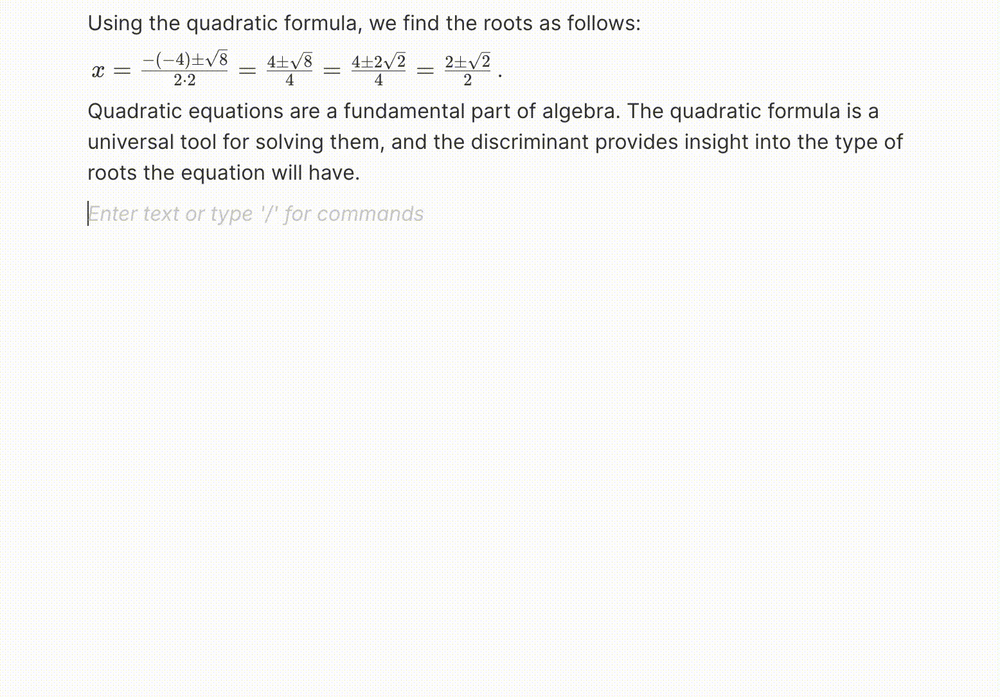
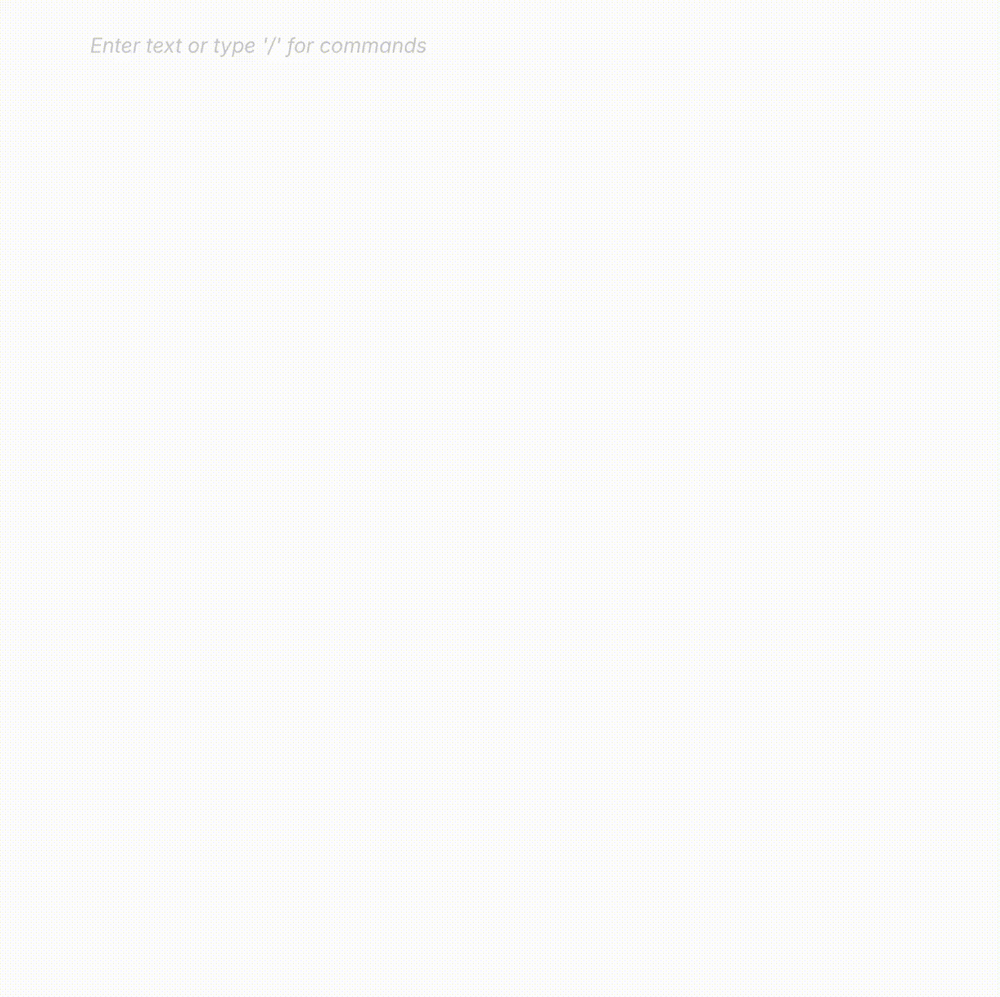
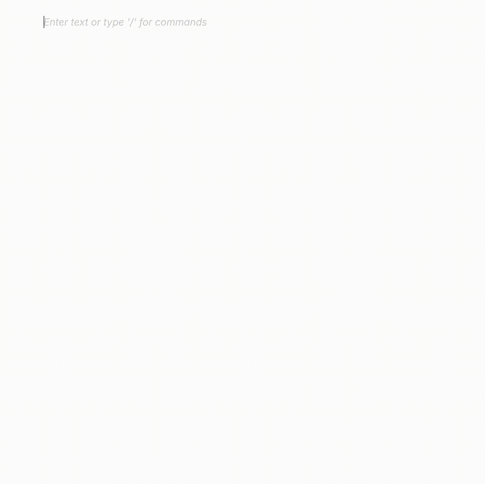

# 🏆 Final Submission for haXathon

## Project
Math & chart integration into Docs

## Project Description
Write and display LaTeX in Docs

## Contributors
<a href="https://github.com/tidann">@tidann</a>, <a href="https://github.com/arkey-dev">@arkey-dev</a>, <a href="https://github.com/plouil">@plouil</a>, <a href="https://github.com/Math-s314">@Math-s314</a>, <a href="https://github.com/SamuelPerezDuarte">@SamuelPerezDuarte</a>, <a href="https://github.com/Withers001">@Withers001</a>

## Code base
<a href="https://github.com/tidann/docs/commits/haXathon">Link to the fork</a>

## Deliverables 

### Examples of LaTeX in Docs

## Key Achievements
- A LaTeX block implementing a design previously proposed in the Docs repo issues, with the Monaco JS code editor framework
- A LaTeX inline component with cool features such as : triple-click and Ctrl+A handling, "Convert from Markdown" button handling, (double) dollar sign syntax 
- A Mermaid block that also implements a design proposed in the Docs repo. It works similarly to the LaTeX block.
- A Chart block to display math functions using CortexJS and ComputeEngine

## Challenges Overcome
The most difficult challenges were in the implementation of new features that "extend" the BlockNote framework. This framework offers the possibility to create custom blocks and inline elements, but there are some technical limitations to the APIs that forced us to do some hacks to make things work. 

## Impact
Students, professors, researchers and more will benefit from this straightforward implementation of basic math & chart editing features in Docs !

## Next Steps
- Implement the export to PDF and DOCX features
- Optimize the code speed and readability
- Fix some bugs ;)