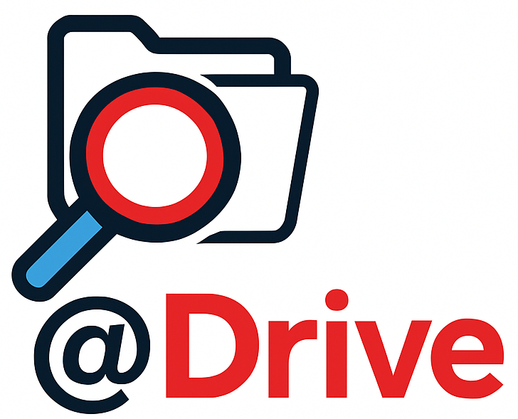
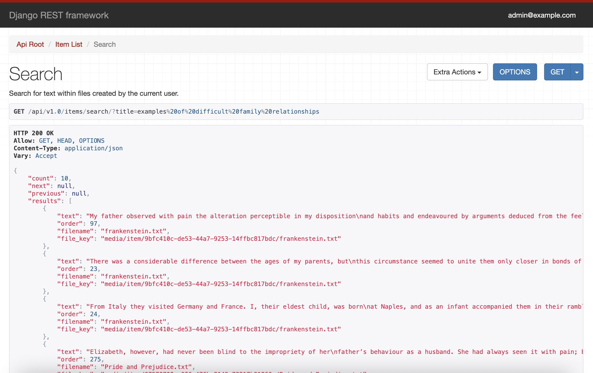
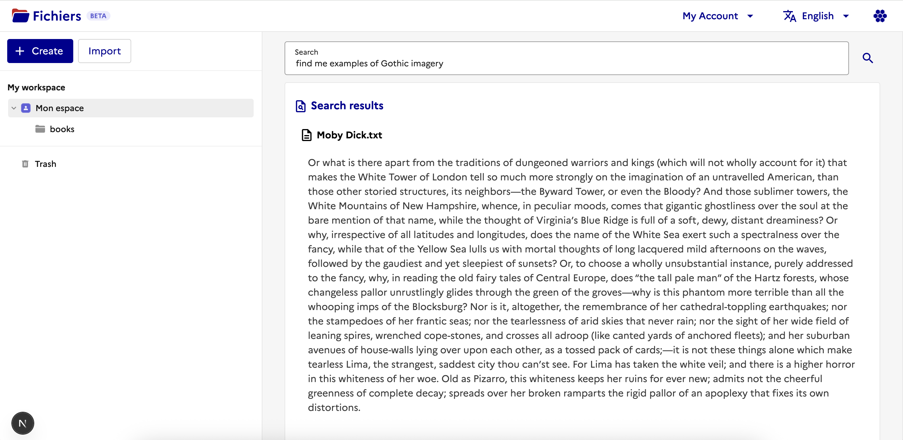
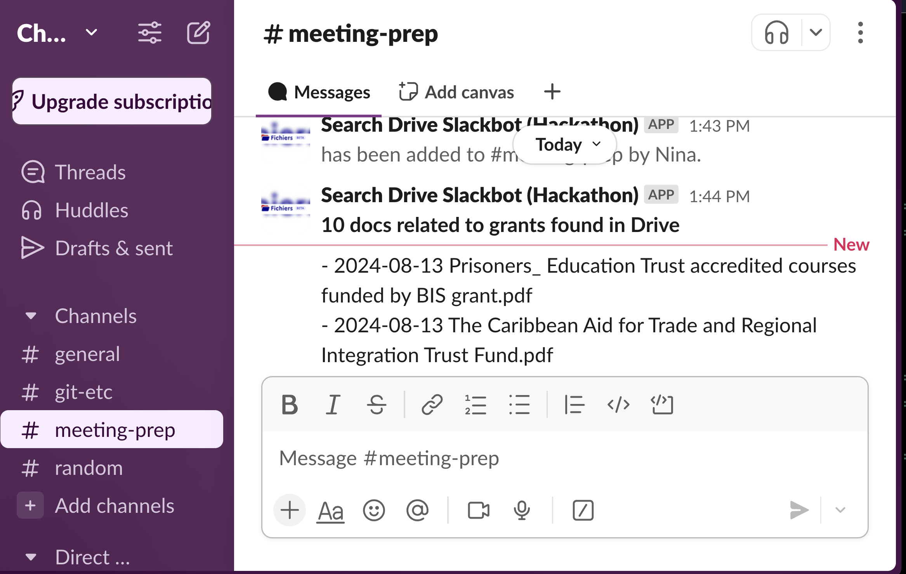

# 🏆 Final Submission for Incubator for AI

## Project

**@Drive**: semantic search for the documents you store in Fichiers/Drive.

## Project Description

We have added semantic-search functionality to `drive`.

The ability to search documents in Fichiers/Drive is exposed to users using a new REST endpoint to:
* The existing La-Suite Fichiers/Drive User Interface
* La-Suite's Visio/Meet
* Slack
and via an [MCP](https://www.anthropic.com/news/model-context-protocol) Proxy service to Claude-Desktop such that Documents can be treated as an AI Agent.

## Contributors
<a href="https://github.com/duncanjbrown">@duncanjbrown</a>, <a href="https://github.com/nmenezes0">@nmenezes0</a>, <a href="https://github.com/gecburton">@gecburton</a>, <a href="https://github.com/rachaelcodes">@rachaelcodes</a>

## Code base
[i.AI fork of suitenumerique/drive](https://github.com/i-dot-ai/drive)

[Slack integration](https://github.com/i-dot-ai/slack-drive-search)

## Deliverables

### Fichiers/Drive API endpoint & MCP Proxy

### Fichiers/Drive UI integration

<video src="https://github.com/user-attachments/assets/557ad7fd-6ddc-4449-aadc-160af46c83f1" controls></video>
_Video not working? [The file is here](assets/drive_search_interface_720.mp4)_

### Visio/Meet integration

<video src="https://github.com/user-attachments/assets/ff1bb5f9-cc18-4596-8929-faf2b7383b23" controls></video>
_Video not working? [The file is here](assets/meet_integration_720.mov)_

### Slack integration

<video src="https://github.com/user-attachments/assets/8da4234b-5124-43d3-8a22-257ec66b3178" controls></video>
_Video not working? [The file is here](assets/slackbot-recording.mov)_

### Claude Desktop integration

<video src="https://private-user-images.githubusercontent.com/23265724/450806742-322a45d4-9801-4a54-b5cc-9eac3e85e863.mov" controls></video>
_Video not working? [The file is here](assets/claude-demo.mov)_

## Key Achievements
Enabling semantic search throughout all documents in Fichiers/Drive and enabling users to query their documents in the frontend.

Demonstrating that it is possible to integrate @drive search with other La Suite Numerique apps and external apps.

Specific examples from the hackathon:

* Claude-Desktop
* Slack
* Visio/Meet

Claude Desktop required us to use a new protocol called MCP. MCP is in early stages of development and has lots of issues and doesnt not yet well integrate with the web framework used by `Docs`, we overcame this with a proxy service

## Challenges Overcome
Setting up and getting to grips with an unknown codebase in a limited time.
Getting semantic search working in Fichiers/Drive.
Integration with other services: Meet, Claude, Slack.

## Impact
Anyone who knows the information they need is stored in Fichiers/Drive, but just can't remember where it is can now search for it easily. By using semantic search, users don't even need to match the exact text in the document or remember the file name.

Opening up the API to other applications takes Fichiers/Drive functionality beyond the immediate application, putting it at the centre of many workflows. 

## Next Steps
* Clean up and test code. Make sure it's secure, using ProConnect.
* Adopt more code patterns from the existing codebase
  * e.g. using the `StandardDriver` for making fetch requests in the UI
* Improve search quality with hybrid search
* Opening up integrations with other applications
  * e.g. find your documents from Docs
* Offering filtering options
  * e.g. only searching documents within particular folders
* Generating themes for uploaded documents, allowing users to search by topic
* Adding more metadata to the search results
  * e.g. date created
* Creating a similar API for other SuiteNumerique services
  * e.g. search through your meeting transcripts with @Meet
* Integrate access to `Fichiers/Drive` into the UK's GOV-AI framework