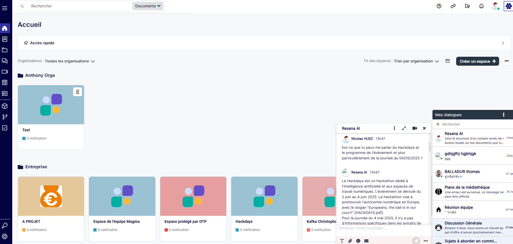
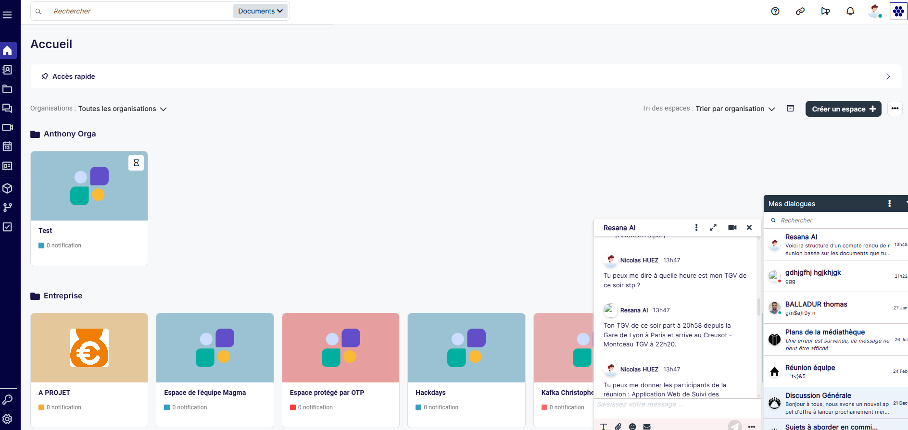
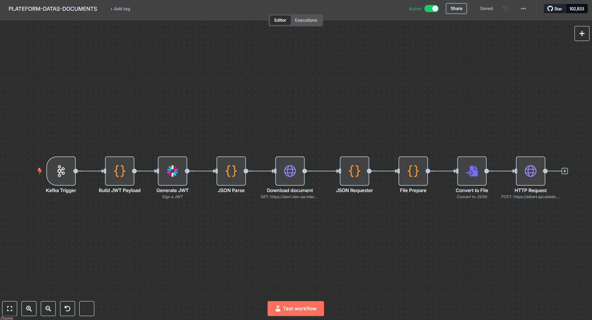
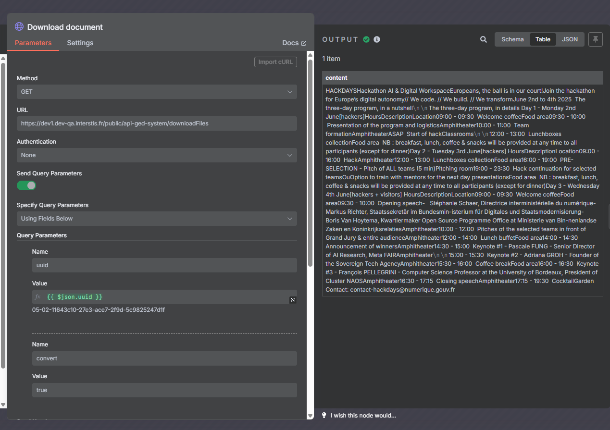
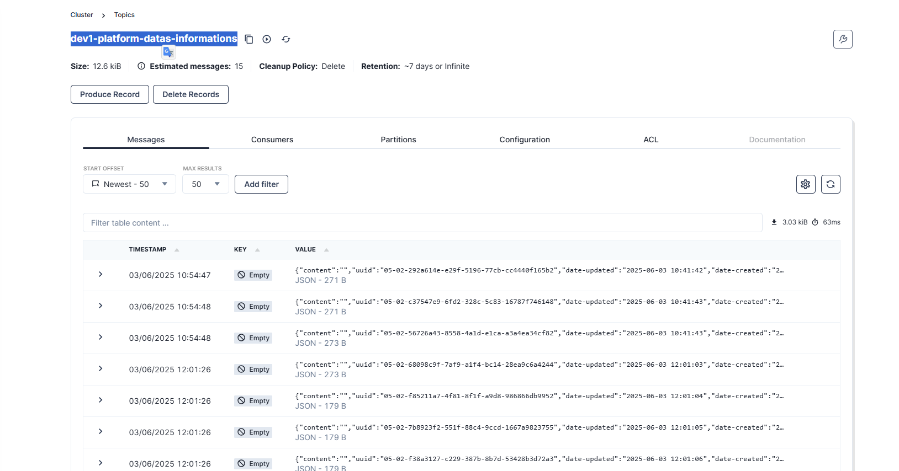

# 🏆 Final Submission — Interstis Hackdays

## Project Description
## 🚀 Project: RESANA & Co

**Integration of the Albert API into the RESANA collaborative platform**  
🧠 Document search, summarization, AI-powered dialogue, and more.

---

## 👥 Contributors
- [@romaindebrito](https://github.com/romaindebrito)
- [@Anthony-Dmn](https://github.com/Anthony-Dmn)

---

## 🧱 Code Base

The code base is shared across all RESANA microservices and is not currently public.

This Proof of Concept (POC) integrates features from the **Albert API** through a gateway, leveraging the following technical stack:

### 🔧 Technical Components
- **Kafka** — Message broker for event handling and asynchronous tasks.
- **PHP (RESANA Core)** — Business logic and integration layer.
- **N8N** — Worker for automations and API interconnectivity.
- **Node.js** — Real-time dialogue management with Albert.

---

### 🧠 Stack Technique

#### 1️⃣ Albert API Gateway Integration

- **Prompt fine-tuning**: Adjusted to improve relevance of AI answers.
- **Connection to RESANA documentation**: Real-time querying of internal data.
- **Contextual document slicing**: Sends only relevant excerpts to the AI.

#### 2️⃣ Integration into RESANA

- **AI chat embedded into dialogues**: Real-time interaction with Albert via Node.js and PHP.
- **Markdown support**: Enhanced readability of AI responses.
- **Document indexing pipeline**:
  - Extracts from PDF, Docx, Excel, TXT.
  - Built with RESANA GED Core, Kafka, and N8N.

---

## 📦 Deliverables

A working prototype is available on the internal **Interstis testing platform**, with full integration of **Albert API** in real-time.

### ✅ Key Features:
- Responds to user queries using the **Albert model**.
- Analyzes and extracts content from uploaded documents (PDF, Excel, Word, TXT).
- Queries the document base when needed to enrich AI responses.

### 📸 Screenshots

#### 🔹 Video demo parcours

#### 🔹 Sample Dialogues with Albert

#### 🔹 Workflows & Results
**N8N Workflow pushing data to Albert:**

**Document content extraction:**

**Kafka message broker output:**

---

## 🛠️ Key Achievements

- ✅ Integrated **Albert API Gateway** with prompt optimization.
- ✅ Enabled dynamic access to the RESANA documentation base.
- ✅ Built a real-time **AI assistant** within user dialogues (PHP + Node.js).
- ✅ Created an indexing pipeline to **analyze document contents** via:
  - GED Core
  - Kafka
  - N8N
- ✅ Enhanced user interaction with **Markdown-formatted AI responses**.

---

## ⚙️ Challenges Overcome

### 🧩 Data Adaptation
Normalized heterogeneous data sources (documents, forms, events) to make them digestible and usable by Albert AI.

### 💬 Real-time Dialogue Rework
Redesigned dialogue flow to support **live, dynamic AI responses**, integrated into RESANA’s existing architecture.

---

## 🔍 Impact

1. **📁 How to easily find a document in RESANA?**  
   ➤ Contextual AI search allows smart filtering and relevance-based retrieval.

2. **📝 How to summarize a group of documents?**  
   ➤ AI-powered summarization based on real-time analysis of related documents.

3. **🧾 How to generate content from templates?**  
   ➤ Prompt Albert to create structured drafts using reference materials.

---

## 🚀 Next Steps

### 🎯 Objectives

1. **Vector Database Integration**  
   ➤ Connect Albert directly to embedded vectors in RESANA to minimize data transfers and boost precision.

2. **Data Isolation by Metadata & Filters**  
   ➤ Use metadata and structured filters to enforce data scoping and better guide AI behavior.

3. **Advanced Prompt Tuning**  
   ➤ Enable deeper analysis and extend use cases (e.g., decision support, reporting).

4. **Asynchronous Automations**  
   - 🔄 Automatic activity summaries (weekly/monthly).
   - 📬 Digest of user notifications based on priority and topics.
   - 📚 Preloading Albert with existing RESANA data for instant knowledge.

---

## 🔮 Vision

This POC lays the foundation for turning Albert into a **true AI co-pilot** within RESANA:  
Not only reactive to prompts — but capable of **proactively assisting** users in their daily collaboration workflows.

---
