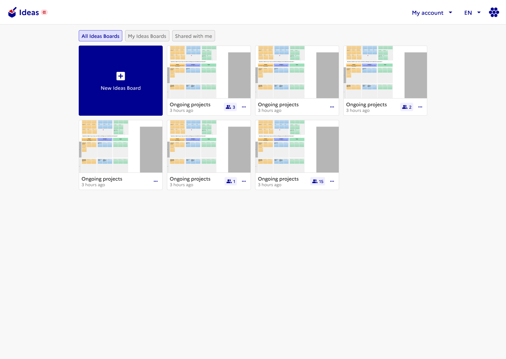
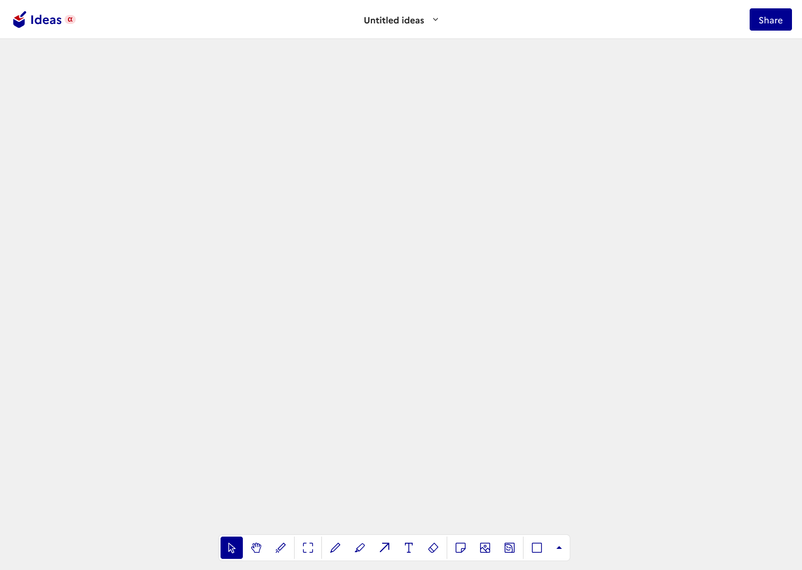

# 🏆 Final Submission for One Point

## Project

 **Ideas**

## Project Description

Collaborative whiteboard that can be integrated in Meet/Visio and Drive (for persitent storage) to allow teams to brainstorm and organise ideas during calls.

## Contributors

<a href="https://github.com/froissant">@froissant</a>, <a href="https://github.com/Tayteus">@Tayteus</a>, <a href="https://github.com/StanleySweet">@StanleySweet</a>, <a href="https://github.com/SouidanOP">@SouidanOP</a>, <a href="https://github.com/JeanMilleronSE">@JeanMilleronSE</a>

## Code base

- [GitHub Repository](https://github.com/froissant/hackdays-2025-team-onepoint)

## Deliverables

- [Live Demo](https://ideas.froissant.work/) (*there is currently no authentication, so you can access the application directly.*)
- [Presentation Deck](assets/Ideas_Teaser.pdf)

### Screenshots

**Homepage of the application**

**Whiteboard**

## Key Achievements

- 🏆 Delivered a working application
- ⌛ Demonstrated the feasibility of the solution while remaining **on time**, **within scope**, and **on budget**
- 🎯 Provided a clear vision for integrating the tool within *La Suite* tools (e.g. Meet/Visio)

## Challenges Overcome

Building a new tool from scratch in just a few days posed significant challenges, such as:

- Managing tight time constraints.
- Familiarising ourselves with the *La Suite* ecosystem and its approach to consistent design integration.
- Constantly balancing trade-offs between limited off-the-shelf tools and fully customised solutions.

## Impact

### Productivity

Enables the creation of simple, visual collaboration canvases for flexible and creative workshops, particularly suited to:

- 🧠 Brainstorming
- ✏️ Diagramming
- 🤝 Meetings & workshops
- 🔄 Agile workflows
- 📊 Strategy & planning

Every whiteboard is persisted, so they can be revisited later, shared with others or exported as images.

### Target Audience

Anyone seeking engaging and enjoyable collaborative features during calls -- which likely includes most teams. This tool helps them:

- Organise ideas and meetings more effectively.
- Create lasting outputs like summaries and reports.

## Next Steps

Several enhancements are needed to bring the project to completion:

### Architecture

The application currently has 5 moving parts, it would be nice to reduce it to three: Front, Back and Albert AI.

### Code Quality / DevOps

Proper linting and CI/CD.

### Security

- Account management
- Roles, permissions, and scopes
- FranceConnect integration

### Internationalisation

- Add support for multiple languages and regional settings

### Dependencies

- Currently heavily relies on [tldraw](https://tldraw.dev/), which displays a watermark. It can be removed by purchasing a commercial licence or developing an in-house infinite canvas

### Performance

The application currently uses static files stored locally. Improvements could include:

- Moving data to a database such as **SQLite**, or a more scalable solution (configurable)
- Using dedicated storage solutions like **Blob Storage** or **S3-compatible** services

### UI Completion

- Implement missing buttons, e.g. **"Share"**
- Bind currently inactive elements, such as the burger menus on the Projects page

### UX Research

- Develop change management and buy-in materials:
  - Communication assets
  - Train-the-trainer documentation

### Industrialisation & Scalability

- Prepare the product for broader deployment and future growth
