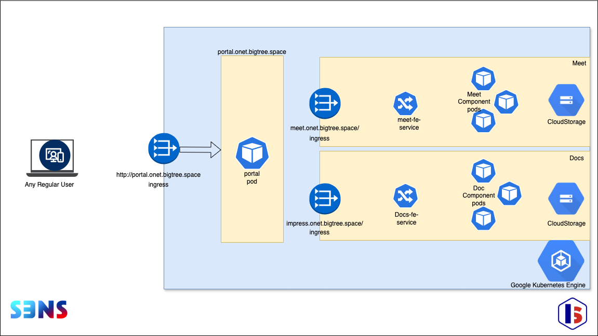
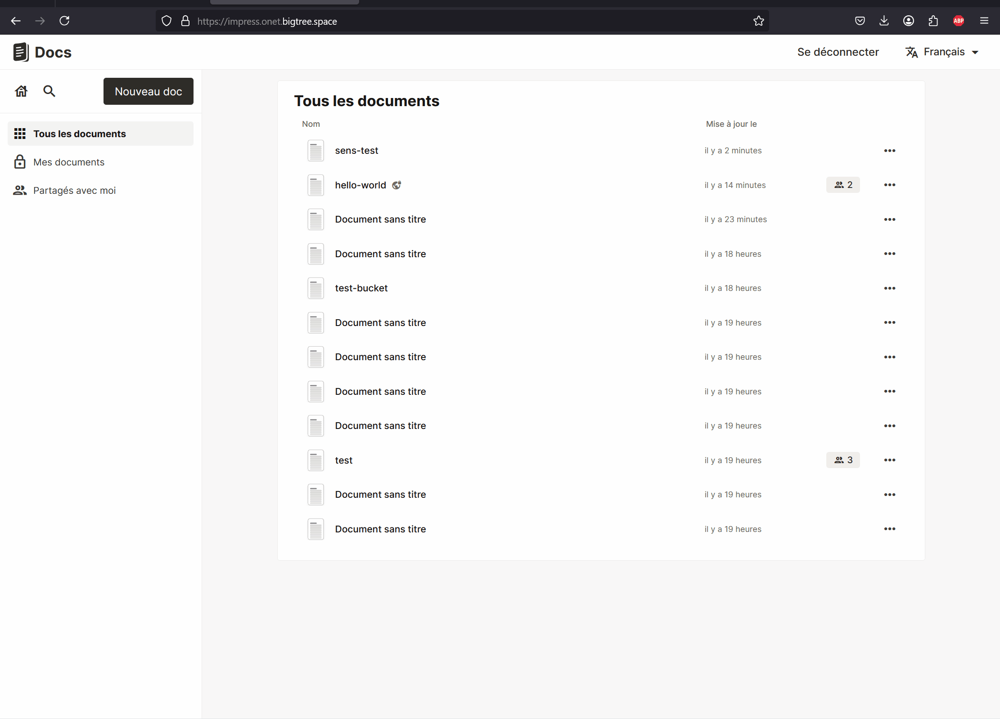

# 🏆 Final Submission for OneT

## Project
SovereignCloudSuite

## Project Description
Deploy multi-tenant "LaSuite" on a SecNumCloud infrastructure with Kubernetes

## Contributors
<a href="https://github.com/gcollongues">@gcollongues</a>, <a href="https://github.com/snaaak">@snaaak</a>, <a href="https://github.com/fp3rr">@fp3rr</a>, <a href="https://github.com/pokepong_">@pokepong_</a>, <a href="https://github.com/tuncaybilgi">@tuncaybilgi</a>, <a href="https://github.com/dmdevito">@dmdevito</a>, <a href="https://github.com/CedricElie">@CedricElie</a>

## Code base
The DevOps Magic  
https://github.com/CedricElie/onet_hackdays  
The upcoming administrative portal  
https://github.com/PokePong/OneTWebApp  

## Deliverables 

Architectural Draft

Meet in S3NS

Docs in S3NS

## Key Achievements
- ⚙️ Deployment of a production-ready **Kubernetes cluster** (GKE) on sovereign cloud platform
- 🔧 Full **Helm-based packaging** of the application suite (Meets & Docs at submission time)
- 🛡️ Infrastructure deployed on **_S3NS_** a **SecNumCloud-certified platform** (compliant with ANSSI security standards)
- 🖥️ Development of a real-time self-service **admin web interface** for managing service instances

## Challenges Overcome
- 🧹 Adapting deployment patterns to **compliance constraints** of sovereign cloud
- 🔐 Configuring IAM, VPC, and secure access layers for real-world production use
- ⚒️ Aligning contributions from a **multi-site, multidisciplinary team** in record time
- ⏱️ Delivering end-to-end functionality **within 2 days**

## Impact
This project showcases a **viable path to European digital sovereignty**.  
It provides a reusable foundation for deploying applications on **trusted, sovereign infrastructure**, making it relevant for:
- Governmental and institutional deployments
- Regulated industries (health, justice, defense)
- Organizations seeking **compliance + flexibility**

## Next Steps
For the future steps. we aim to :
- 📱 Connect our admin UI to a real **control plane / service catalog**
- 🔐 Integrate **identity federation** (SSO / LDAP / IAM)
- 📊 Add observability stack (Prometheus / Grafana)
- 🧪 Harden and certify deployment pipelines
- ♻️ Expand deployment to additional environments (staging/prod)