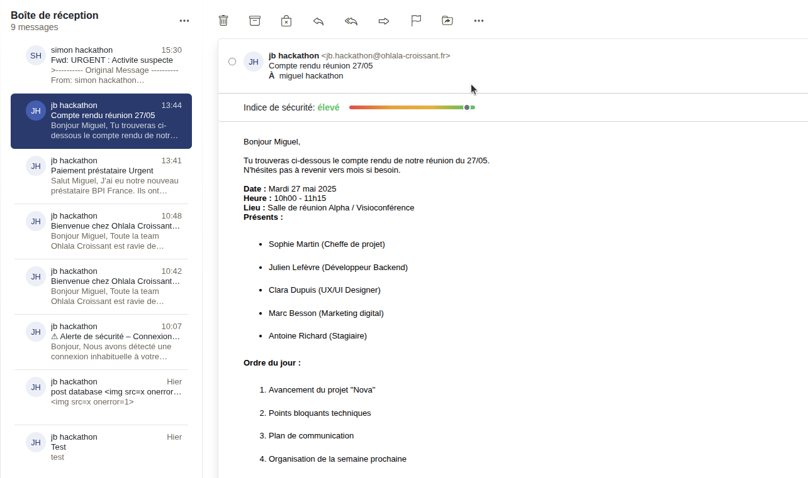

# 🏆 Final Submission for Sovereign42

## Project
📨 **MailGuard**

## Project Description
🔐 **MailGuard** is a lightweight, **AI-enhanced** plugin for the **Open-Xchange** email client that **protects users from phishing threats** by scoring incoming emails in real time.
It analyzes tone, urgency, sender identity, and embedded links, using both machine learning and threat intelligence to alert users via a color-coded risk bar. 
Clear, contextual warnings and actionable tips help users make smarter decisions with every email.

## Contributors
<a href="https://github.com/Frenzla">@Frenzla</a>, <a href="https://github.com/JeanBRen">@JeanBRen</a>, <a href="https://github.com/Helios5D">@Helios5D</a>, <a href="https://github.com/msima0">@msima0</a>, <a href="https://github.com/extrymes">@extrymes</a>

## Code base
🪄 Our repository : https://github.com/extrymes/project-hackdays2025

## Deliverables
🎖️ Examples : 

## Key Achievements
🚀 What We Built in 48 Hours:

- ✅ Complete integration with Open-Xchange email client

- 🤖 AI-based tone and urgency detection with minimal latency

- 🧠 Hybrid detection system using NLP + real-time blacklists

- 📊 Smart warning system with natural language recommendations

- 🔧 Sleek UI bar that blends with native client design

## Challenges Overcome
🧩 What We Solved:

- 🤹 Handling real-time analysis without interrupting user workflow

- 🔨 Integration to Open-Xchange client

- 🕵️ Fine-tuning phishing detection to minimize false alarms

- 🧱 Embedding ML models in a plugin architecture with strict performance constraints

- 🧠 Adapting NLP techniques to messy, short-form email content

## Impact
🌍 Who Benefits and Why It Matters:

- 🆓 Fully open source, ensuring transparency, auditability, and long-term trust in public infrastructure

- 👥 Everyone benefits: end users, public servants, IT administrators, companies, and collectivités all gain stronger, more understandable protection from phishing threats

- 🧰 Designed to be lightweight, easy to deploy, and non-intrusive—ideal for large-scale institutional rollout

- 🇪🇺 Supports digital sovereignty by avoiding reliance on closed-source, foreign-owned security tools

- 🧠 Raises phishing awareness through simple, human-readable explanations—training users as they work

## Next Steps
🔮 Where We’re Headed Next:

- 🛡️ Add checkers (ex: handle attachments) for better accuracy

- 🎯 Risk scoring customization for advanced users/admins

- 🏢 Organization-wide learning: enable large collectivités and companies to fine-tune detection models based on patterns across all employee emails—improving precision and catching threats earlier at scale

- 🧩 Expand to other platforms: Gmail, Outlook
