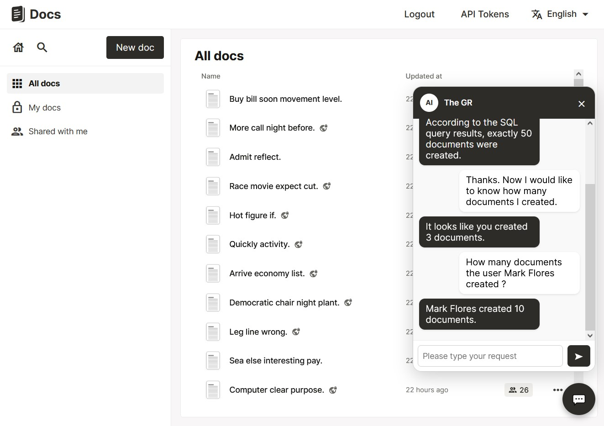
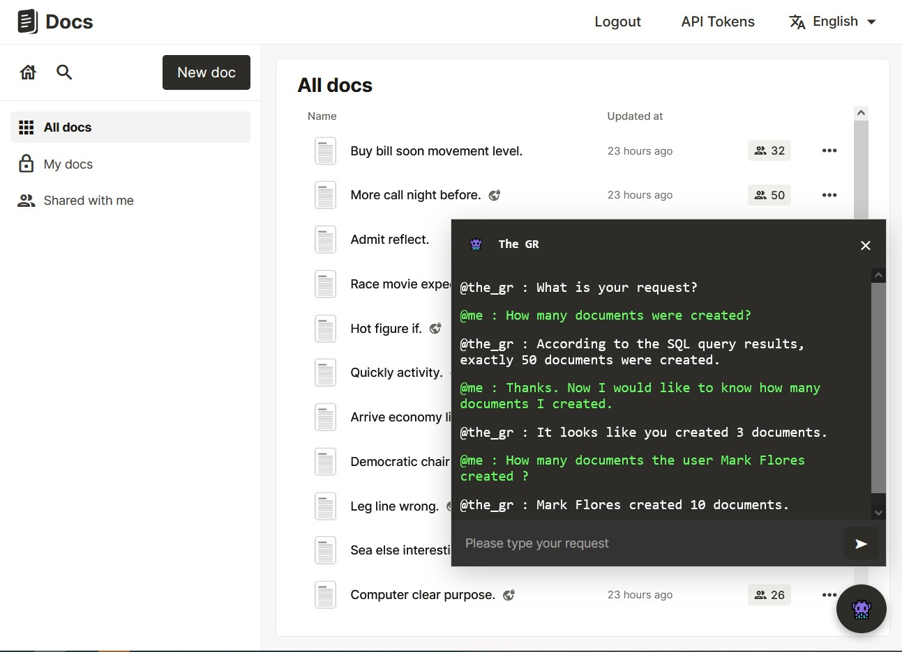

# 🏆 Final Submission for The GR

## Project
Docs - AI agent to convert user prompts to SQL queries in order to retrieve Docs instance data

## Project Description
This project aims to develop an AI-powered agent integrated into Docs that can manage and interact with the platform’s backend database using natural language commands.

Instead of requiring technical administrators to write manual SQL queries, the AI agent translates natural language prompts into safe, executable SQL commands — helping with tasks like reporting, user management, system auditing, and performance monitoring.

By combining NL-to-SQL models with a secure execution layer, the system enables non-technical admins and managers to access, analyze, and manage platform data efficiently, all from within the Docs interface.

## Contributors
* Gaspard Villa ([@gaspardvilla](https://github.com/gaspardvilla))
* Omar Zouiche ([@ZouicheOmar](https://github.com/zouicheomar))
* Julien Peria ([@julienperia](https://github.com/julienperia))
* Isaac Gros ([@isaac-gros](https://github.com/isaac-gros))

## Code base
[- [GitHub repository] -](https://github.com/gaspardvilla/TheGR_Docs.git)

## Deliverables 

## Key Achievements
*(Highlight the main features or breakthroughs)*
* AI agent chat that allows you to interact with your Docs instance database
* Start from a natural language prompt, the AI agent will translate it into a SQL query and we translate the results into a natural language response corresponding to the initial prompt
* Security layer to prevent any lethal modififcation of the database
* Hidden chat appearance feature (will you find it? 👀)

## Challenges Overcome
*(What was difficult? What did you solve?)*
The main challenges came from the backend. We had to implement a secure execution layer to prevent illegal SQL commands from being executed by any user. For "super-user" commands, we want to implement a double-check system to prevent any lethal modififcation of the database.

## Impact
*(Who will benefit from your project?)*
The project is beneficial for non-technical admins and managers who want to access, analyze, and manage platform data efficiently, all from within the Docs interface. It also provides a secure way to execute SQL commands, which can help prevent data loss and corruption.
It also provides a tool to keep track of the database and its evolution over time (weekly, monthly, yearly reports/checks).

## Next Steps
*(If you were to continue, what next steps or developments would you envision?)*
* Ensure access management of the database by managers
* Enable modification and deletion for manager users (eg: share document between users, update document privacy etc.), with confirmation before update
* Add a NL2PDF (or NL2Image) model at the end of the pipeline to generate a PDF report (or an image) corresponding to the initial prompt if the user requests it (i.e. "generate a PDF report (or an image) of the last 30 days of user activity" -> the AI agent will translate it into a SQL query and we translate the results into a PDF report (or an image))
* Add on-demand small data vizualisations straight into the AI Agent chat

* **Bonus :** Make a generalization of the agent that can produce new data bases from natural language prompts

