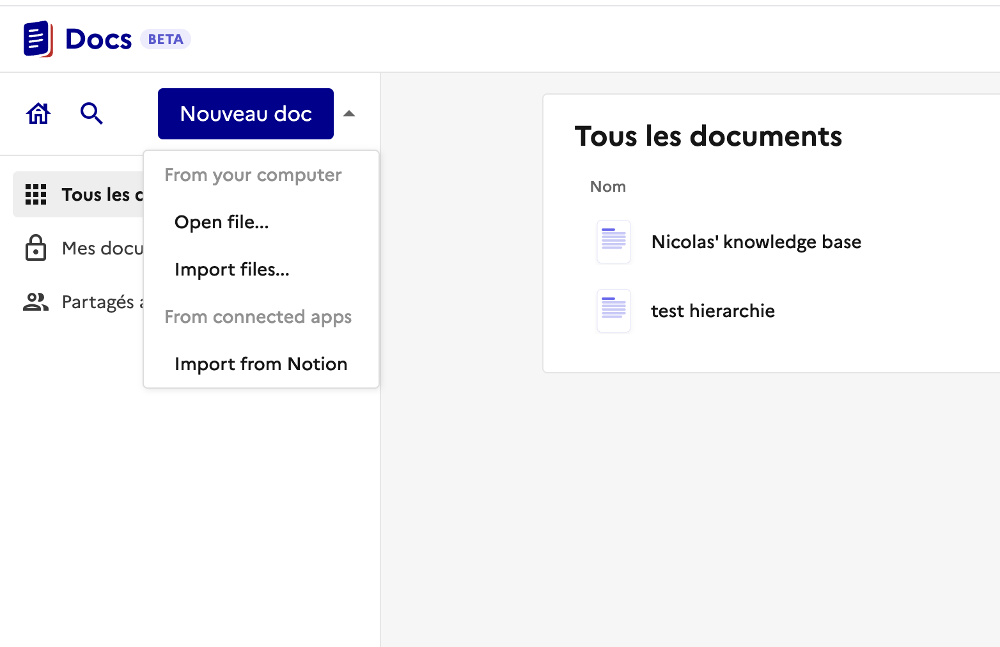
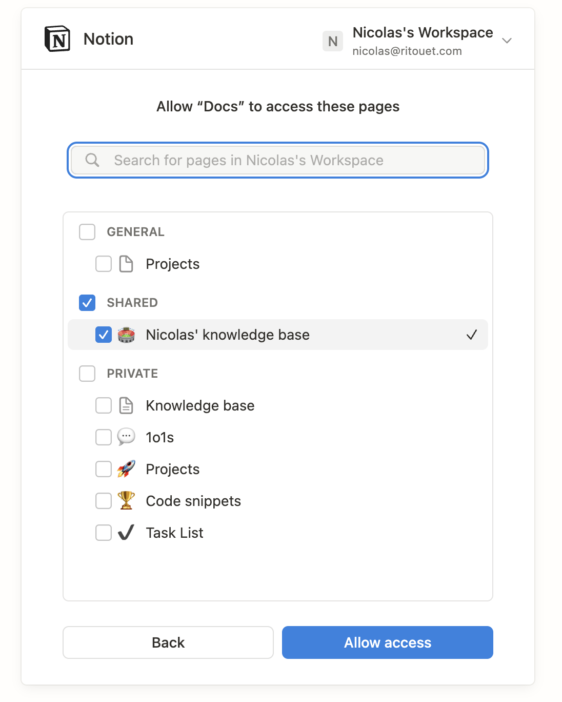
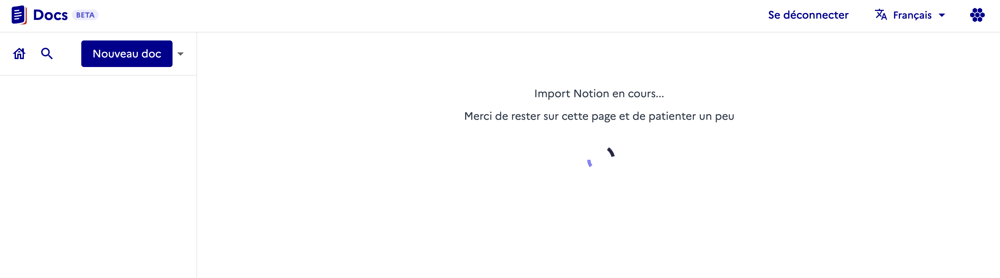
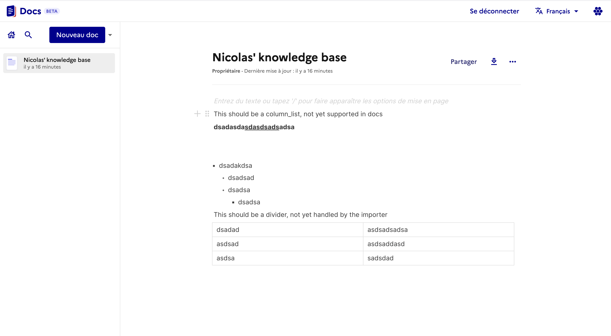

# 🏆 Final Submission for The importers

## Project
Migrate from Notion to Docs

## Project Description
Our goal is to enable seamless migration of content from a Notion workspace into docs, making it easy for organizations to adopt the platform without losing their existing knowledge base. This feature allows users to transfer pages, hierarchies, and content from Notion to docs with minimal effort and maximum fidelity.

## Contributors
<a href="https://github.com/clarani">@clarani</a>, <a href="https://github.com/Tguisnet">@Tguisnet</a>, <a href="https://github.com/emersion">@emersion</a>, <a href="https://github.com/Castavo">@Castavo</a>, <a href="https://github.com/Nicolasritouet">@Nicolasritouet</a>

## Code base
https://github.com/NicolasRitouet/docs/tree/feature/doc-dnd
We worked on the existing "page hierarchy" branch as it provided essential features for our project.

## Deliverables 

### screenshots

### Video
[Demo video](./assets/notion-to-docs-demo.webm)

## Key Achievements
- Implemented authentication and integration with the Notion API
- Enabled selection and import of entire Notion workspaces
- Developed mapping logic to preserve page hierarchy and structure
- Successfully imported Notion content into docs with minimal data loss
- Designed a user-friendly UI/UX to guide users through the import process
- Provided clear feedback and error handling for a smooth experience (WIP)

## Challenges Overcome
- Navigating the complexity of the Notion API and handling permissions
- Mapping different data models between Notion and docs
- Integrating the import feature into the existing docs codebase
- Managing time constraints and rapid prototyping during the hackathon

## Impact
This feature will benefit all current and future users of docs, especially public sector organizations looking to migrate from Notion. It lowers the barrier to adoption and ensures continuity of knowledge and documentation.

## Next Steps
- Support for additional tools (outline, DocSpec, etc...)
- Enhanced mapping and data transformation for richer content fidelity
- Automation of recurring imports and synchronization
- Further UI/UX improvements based on user feedback
