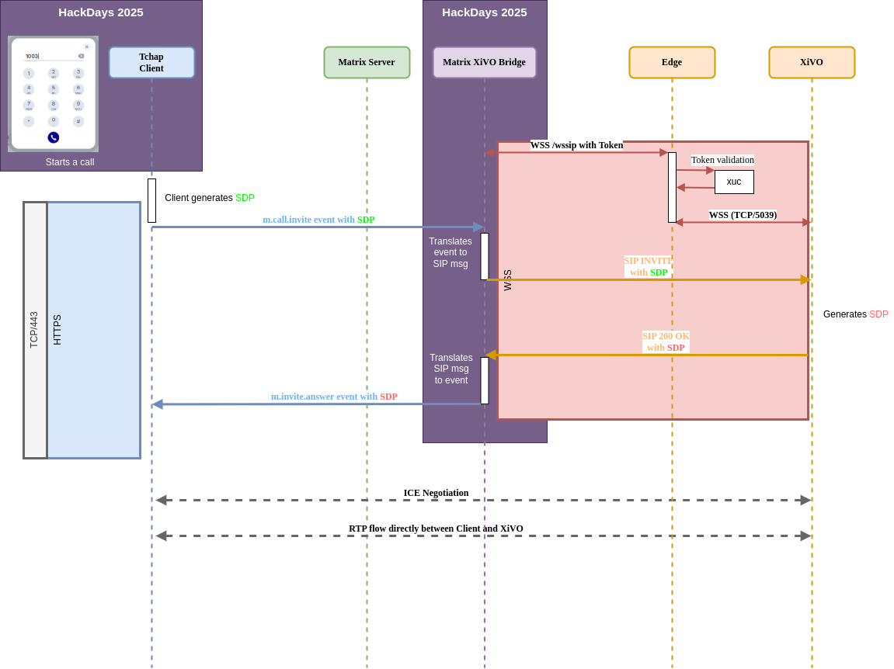

# 🏆 Final Submission for XiVO SIP legacy dring dring tut tut telephony experts

## Final Project Description
Project enables a flexible SIP Telephony bridge to merge VoIP usage inside Tchap. This bridge aims to work with any Element web flavored UI.

It displays a dialpad directly embeded in Tchap UI without any external widget integration to make calls

### Global Overview

## Team
- **Lead**: @ajantiss Laurent Meiller
- **Members**: @eallovon Etienne Allovon, @erwansvl Erwan Sevellec, @furiousturtle Tony Mourier

## Code base
[link to repo](https://gitlab.com/avencall/xivo-connect/matrix-xivo-bridge/-/tree/hackdays2025-minimal-setup)

## Deliverables 

link to video [demo.mp4](./assets/demo.mp4)

## Key Achievements
- Allow make calls to any external phone number
- Interoperability between softphony (Tchap) and existing deskphones in the same workplace

## Challenges Overcome
1️⃣ First challenge is to smoothly integrate call towards external phone numbers inside Tchap Web client.
This challenge is eased by the possibility offered by [MSC2845](https://github.com/matrix-org/matrix-spec-proposals/blob/dbkr/msc2845/proposals/2845-thirdparty-api-phone.md) which allows to delegate to a 3rd party application the lookup for a phone number into a Matrix user.

2️⃣ The second challenge is then to implement it in an [Application Service](https://spec.matrix.org/v1.14/application-service-api/) which registers this thirdparty pstn protocol. 

- this Application Service must answer the lookup (e.g. `thirdparty/user/m.protocol.pstn?m.id.phone=1003`) with a matrix user id. Which means to create a ghost for each number called.
- when the lookup is answered, Element Web will create the corresponding DM with the ghost user and place a call (i.e. `m.call.invite`) in it. Therefore the Application Service must:
  - handle these call events (`m.call.invite`, `m.call.candidates` ...)
  - translate them into SIP messages
- the Application Service is therefore also a SIP client and must handle the logic of these SIP calls (SIP registration, calls, hold, resume etc.).

Most of this work was done prior to the hackathon for our own instance of Element soft fork (XiVO Connect).

During the Hackathon the main focus were:
- to integrate our Bridge (a.k.a. Application Service) in a vanilla Synapse server, therefore we cannot use the integration with our Synapse module
- and make it work in the Tchap Element Web fork

## Impact
All workplaces where exists a mix of legacy PSTN deskphones, conference room devices, DECT... and Tchap softphony. The main goal of this POC is to show that we can help in change management by merging telephony in unified communication tool.

## Next Steps
- Be able to handle incoming calls without custom Synapse module
- Use livekit instead of SIP.js to be Element Call ready
- Don't use (only) PSTN existing MSC but a custom dialpad embeded to a telephony widget.
- Move some features of XiVO synapse module to XiVO widget (history, phone directory, call forwarding, device selection...)
