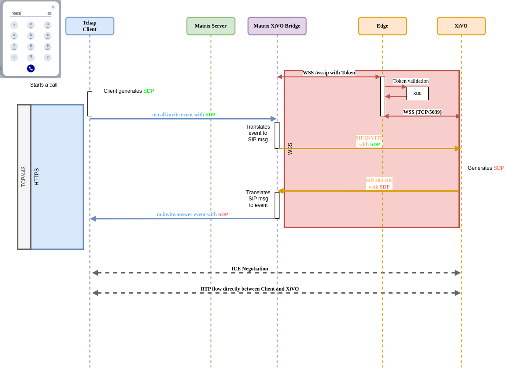

# 🏆 Final Submission for XiVO SIP legacy dring dring tut tut telephony experts

## Final Project Description
Project enables a flexible SIP Telephony bridge to merge VoIP usage inside Tchap. This bridge aims to work with any Element web flavored UI.

It displays a dialpad directly embeded in Tchap UI without any external widget integration to make calls

### Global Overview

## Team
- **Lead**: @ajantiss Laurent Meiller
- **Members**: @eallovon Etienne Allovon, @erwansvl Erwan Sevellec, @furiousturtle Tony Mourier

## Code base
[link to repo](https://gitlab.com/avencall/xivo-connect/matrix-xivo-bridge/-/tree/hackdays2025-minimal-setup)

## Deliverables 
<video src="./assets/demo.mp4" width="600" height="340"></video>

## Key Achievements
- Allow make calls from/to any external phone number
- Interoperability between softphony (Tchap) and existing deskphones in the same workplace

## Challenges Overcome
We used a custom bridge we already developped for our own instance of Element soft fork (xivo-connect)

However here, main concern was to start the bridge with a minimal setup (synapse and element-web vanilla only). We were not able to use custom API nor service account. All logic was revamped to be able to route directly within native application service.

## Impact
All workplaces where exists a mix of legacy PSTN deskphones, conference room devices, DECT... and Tchap softphony. The main goal of this POC is to show that we can help in change management by merging telephony in unified communication tool.

## Next Steps
- Use livekit instead of SIP.js to be Element Call ready
- Don't use (only) PSTN existing MSC but a custom dialpad embeded to a telephony widget.
- Move some features of XiVO synapse module to XiVO widget (history, phone directory, call forwarding, device selection...)
